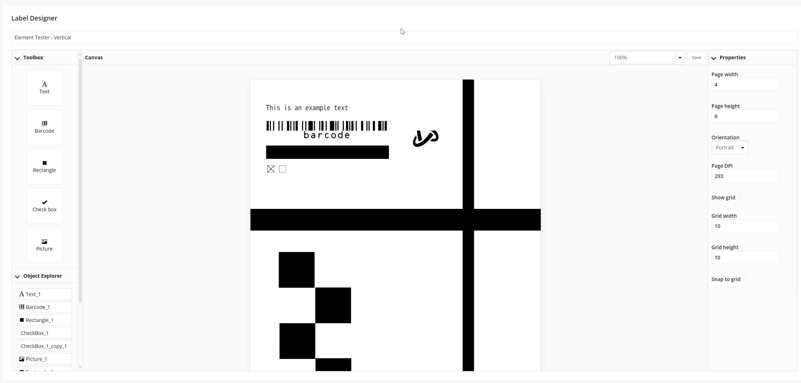

# Label Designer Widget for Mendix

The Label Designer is a WYSIWYG (What You See Is What You Get) editor for creating label templates directly within Mendix-based applications. It offers a comprehensive set of features for designing and printing labels, making it a versatile tool for various industries and use cases.

## Start guide

👉 [Label designer documentation](https://github.com/CapeGroep/LabelDesigner-documentation)

## Key Features

### 1. Text Manipulation
- **Add Text**: Users can easily add text elements to their labels.
- **Color Options**: Choose between black and white text.
- **Size Adjustment**: Modify text size to fit label requirements.
- **Styling**: Apply bold, italic, or normal font styles.

### 2. Shape Integration
- **Rectangle Addition**: Insert rectangular shapes into the label design.
- **Resizing**: Adjust the dimensions of added rectangles.

### 3. Form Elements
- **Checkbox Integration**: Add checkboxes to create interactive label designs.

### 4. Barcode Support
The widget supports various barcode formats, including:
- Code-128 / GS1
- Code-39
- QR Code
- Interleaved 2 of 5
- PDF 417

### 5. Layout and Format Options
- **DPI Adjustment**: Change the dots per inch to affect print quality and size.
- **Orientation**: Switch between portrait and landscape modes.
- **Paper Formats**: Offers a variety of standard label paper sizes.

### 6. Output Flexibility
Generate labels in multiple formats:
- Image files
- PDF documents
- ZPL (Zebra Programming Language) for direct thermal printer output

### 7. Dynamic Content
- **Placeholder System**: Insert placeholders that can be replaced with real values at runtime.

### 8. Image Handling
- **Automatic B&W Conversion**: Convert color images to black and white for compatibility with thermal printers.

### 9. Template Management
- **Export/Import**: Save and load label templates for reuse or sharing.
- **Duplication**: Easily create copies of existing templates for modification.

### 10. User Interface Enhancements
- **Zooming**: Zoom in or out for detailed editing or overview.
- **Responsive Layout**: Adapts to different screen sizes and resolutions.

## Applications
This widget is particularly useful for businesses that need to create and print labels, such as:
- Logistics and shipping companies
- Retail businesses for price tags and product labels
- Warehouses for inventory management
- Manufacturing for product identification and tracking
- Healthcare for patient wristbands and medication labels

## Benefits
- **User-Friendly**: The WYSIWYG interface makes it easy for non-technical users to design labels.
- **Flexibility**: Supports a wide range of label types and printing formats.
- **Integration**: Seamlessly integrates with Mendix applications, allowing for dynamic data insertion.
- **Efficiency**: Speeds up the label design process with intuitive tools and template management.

## Resources

├── README.md
├── docs
│   ├── README.md
│   ├── _sidebar.md
│   ├── img
│   │   └── LabelDesigner.png
│   ├── index.html
│   └── label-designer-implementation-guide.md
└── resources
    └── LabelDesignerDemo.mpk